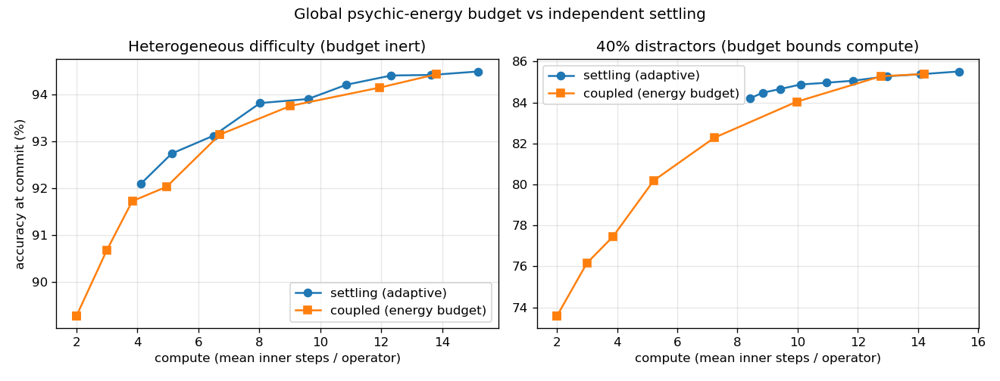
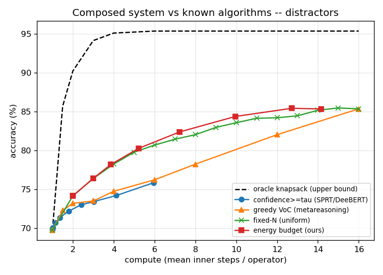
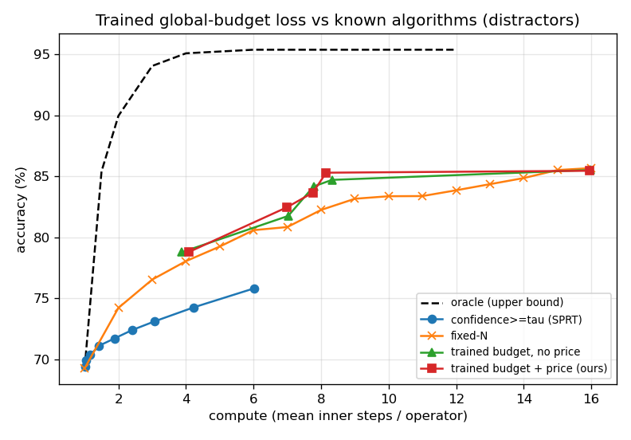
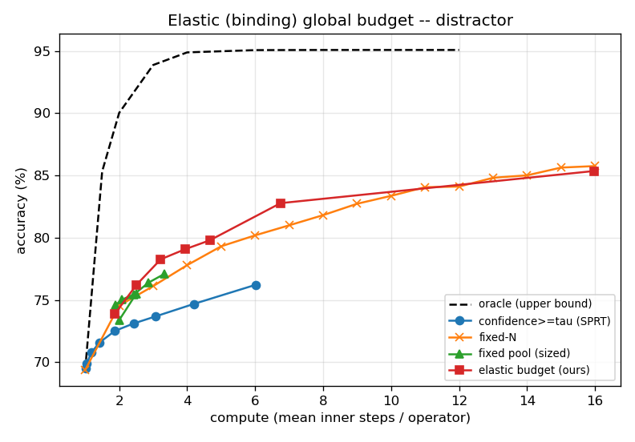

# opposition-synthesis — making "holding the tension of opposites" literal

> **ELI5:** opposites are held by a *string*; the answer is what's left **perpendicular** to their
> tug-of-war (they cancel along the line of disagreement, a third thing survives off to the side).
> Then: give many such operators one shared pool of "mental energy" and see if sharing helps.
> **Genuinely new:** (1) the **orthogonal-projection synthesis** — a real, structural "third thing"
> with a real tension signal `‖p_a−p_b‖`; (2) a **shared energy budget tied into the loss** so a
> group of operators learns to *triage*.
> **Useful? / advantage:** ✅ **Part A is the one genuinely-new *and* better result:** it stays
> accurate **3–4× outside its training range** where black-box baselines collapse. ⚠️ The budget
> work gives **one narrow win** (triaging hopeless sub-problems beats simple baselines) and
> otherwise ties them; co-training the readout to push further gave **no gain** (the rest of the gap
> is irreducible noise). (Stage 6 — read the parts below in order.)

The earlier `tension-block` named its halt signal "tension" (the field speed `‖Δh‖`), but
Experiment B (see `../tension-block/README.md`) **falsified** that signal twice: it adds ~0 and
is a poor halt cue. The lesson: if "tension" is going to be load-bearing, it has to be a *real,
structural* quantity, not a post-hoc readout. This directory rebuilds the idea so the geometry
is literal.

## The metaphor, formalized

The poles are not potential wells; they are held by a **string**, and the tension is literally
the stretch of that string. The poles roll down the loss; because they are *opposites*, the
bottom along the axis of opposition is **0** (they cancel) and what survives is an **orthogonal**
new state — a third thing (the synthesis).

For `K` opposing pairs, pair *i* = `(p_a, p_b)`:
- **string vector** `d_i = p_a − p_b`; **tension** `t_i = ‖d_i‖` (how far the string is stretched);
  **opposition axis** `u_i = d_i / ‖d_i‖`.
- **agreement** (midpoint) `m_i = (p_a + p_b)/2`.
- **synthesis** = the aggregated agreement projected onto the orthogonal complement of the
  opposition subspace `U = span{u_1..u_K}`:  `z = P_{U⊥} · mean_i(m_i)`.

That projection is exactly the **minimum-energy (settled) state** of unit springs pulling along
the `u_i` — the bottom of the loss the strings roll down. The opposition-axis components are
cancelled to 0; `z` is the third thing.

## Part A — `synth_opposites.py`: is the orthogonal synthesis real and load-bearing?

Synthetic task: `N = 2K` poles in `K` **imbalanced** opposing pairs (`|α| ≠ |β|`) around a
hidden synthesis `g` that lives in the orthogonal complement; label = the quadrant of `g`. The
imbalance means the naive **mean of the poles keeps a residual along `u_i` that grows with
tension** — so cancellation is *not* free. Train on tension `∈[0.5,1.5]`; test in-band and on an
unseen, much larger band `[4,6]`.

| model | acc @train band | acc @unseen band | drop |
|---|---|---|---|
| MLP (black box) | 96.7 | 87.7 | 9.0 |
| OppositionSynth **NOPROJ** (ablation, identical head) | 97.0 | 87.9 | 9.1 |
| **OppositionSynth (ours, project)** | 95.6 | **97.8** | **−2.3** |

Accuracy vs tension magnitude (train band = first two columns):

| band | 0.5–1 | 1–1.5 | 2–2.5 | 3–3.5 | 4–5 | 5–6 | 6–8 |
|---|---|---|---|---|---|---|---|
| MLP | 97.2 | 96.6 | 94.6 | 90.7 | 89.5 | 87.1 | 83.5 |
| NOPROJ | 97.2 | 96.4 | 94.7 | 91.8 | 90.0 | 87.3 | 84.0 |
| **ours** | 93.8 | 95.8 | 97.2 | 97.5 | 98.6 | 97.9 | **98.2** |

- **The orthogonal projection is the whole story.** Ours is the only model invariant to tension
  magnitude — flat/rising accuracy and it *extrapolates* to a tension band 3–4× larger than
  training. The identical-capacity no-projection ablation degrades exactly like the black box.
  This is a real capability the baselines structurally lack (cf. the extrapolation claim in coin
  Bench 1) — and, unlike `‖Δh‖`, the tension geometry here is **load-bearing**.
- **The block reads *real* tension:** `corr(measured ‖p_a−p_b‖, true tension τ) = 0.999`.
- **Honest limitation:** ours is slightly *worse* at the smallest tension (93.8 @ 0.5–1.0) —
  when the string is barely stretched the opposition axis `u_i` is ill-determined (≈ noise), so
  the projection removes a little real signal. Low tension = ill-defined opposition. Sensible.

## Part B — `tension_synth_operator.py`: learning when to *cut the string* (commit)

Part A computes the settled equilibrium in closed form. Part B makes it iterative — the estimate
of the third thing rolls toward the spring equilibrium over inner steps — and adds the full
tension *contract*: it **holds** (emits the zero vector while undecided), **deliberates** across
many steps, **persists state across separate calls** (one forward cannot produce the answer), and
**commits** when settled, from `(extrinsic)` the external facts and `(intrinsic)` its own tension
state `{t_i}` and settling speed. Trained PonderNet-style with a compute penalty, with the
Experiment-B ablation built in (does the structural tension signal carry weight?).

## Part C — `energy_budget.py`: a global "psychic energy budget" over a *composed* system

A single operator carries a *static* per-block commit penalty `λ`. Part C asks whether a
**finite, shared, dynamic** energy pool over *M* operators (a "mind") buys anything. The physics
is the string metaphor taken literally: **holding a stretched string is metabolically expensive**
(it drains the shared pool each tick), **committing refunds** the released energy to the pool
(`+γ`, so clean resolutions subsidize ongoing ones), and the pool may **replenish** (`refill ρ`,
a dynamic budget). Scarcity appears to every operator as a **dynamic shadow price** `λ(E)` that
rises as the pool drains — the old static `λ` becomes a *state* — and pushes the whole mind toward
commitment: `commit when settledness s ≤ θ·price(E)`.

Three policies, fair-by-construction (same readout, same settledness signal, same pool+refund —
**only the price response differs**): `settling` (price≡1, no pool — the strong adaptive
baseline), `hardstop` (finite pool but price≡1: ignore it, then guillotine everything when empty),
`coupled` (price rises as the pool drains: graceful early commit under scarcity). Difficulty is
per-operator observation noise `σ`; sweep the knob to trace the accuracy-vs-compute frontier.

**Verdict — the budget is falsified as an *accuracy* mechanism (a third honest negative, after
`‖Δh‖` twice).** At *matched compute* per-operator settling ties or beats the coupled budget in
every non-adversarial regime:

| regime | result |
|---|---|
| Exp 1 heterogeneous difficulty | coupled frontier sits *on/slightly below* settling — inert-to-harmful |
| Exp 2 same pool, price vs guillotine | **identical** accuracy (e.g. 90.66 vs 90.67) despite 100% vs 0% forced commits |
| Exp 3 homogeneous (control) | coupled ≈ settling, as predicted |

The reason is sharp: **per-op settledness is already a near-sufficient statistic for value-of-
compute** on these tasks (a noisy operator settles slower and is *given* more steps on its own),
and diminishing returns (`∼1/√k` averaging) make even a hard truncation almost free — so a global
price has nothing left to reallocate, and the extra coupling only adds noise to the commit
decision.

**The one regime where the pool earns its keep is *compute robustness*, not accuracy (Exp 4).**
With 40% hopeless distractor operators (`σ=5`, never settle), settling is *hostage to its worst
operators*: it has a hard compute floor (~8.4 steps/op) it cannot go below, because the
distractors drag the mean to max compute no matter how it's tuned. The finite budget bounds
compute to *any* target (down to 2 steps/op) by triaging the non-settling drains out via the
rising price. At exactly matched compute it's still ~on par with settling — the win is that a
finite pool **cannot be dragged into deliberating forever**, which is exactly the "finite energy
for this thought" intuition.

### vs *known algorithms* — `compare_baselines.py` (the real test)

The above only pits the budget against our own settling variants. The proper benchmark is the
standard literature for adaptive stopping + budgeted compute allocation: **Fixed-N** (uniform,
non-adaptive), **confidence≥τ** (Wald's SPRT / DeeBERT/entropy early-exit — the standard adaptive
per-problem rule), **greedy value-of-computation** (metareasoning: fund the least-confident
operator until the shared budget is gone), and a label-aware **oracle knapsack** ceiling. All
share the readout/observations; we sweep each one's knob to trace accuracy-vs-compute.

Heterogeneous (benign), accuracy at matched compute:

| steps/op | Fixed-N | conf≥τ (SPRT/DeeBERT) | greedy VoC | oracle | **energy budget (ours)** |
|---|---|---|---|---|---|
| ~2 | 89.0 | 89.4 | 90.0 | 97.1 | 89.0 |
| ~4 | 91.8 | 91.9 | 91.9 | 98.3 | 91.8 |
| ~8 | 93.8 | **94.3** | 94.2 | 98.3 | 94.0 |

Distractors (40% hopeless ops):

| steps/op | Fixed-N | conf≥τ | greedy VoC | oracle | **ours** |
|---|---|---|---|---|---|
| ~4 | 78.2 | 74.6 | 75.0 | 95.2 | 78.2 |
| ~6 | 80.8 | 75.8 *(caps out)* | 76.4 | 95.5 | 80.3 |
| ~8 | 82.2 | — | 78.4 | 95.5 | **84.6** |

Three honest conclusions:
1. **In the benign case the budget does not win.** It ties naive Fixed-N and is *slightly behind*
   plain confidence-threshold early-exit (SPRT/DeeBERT), the standard adaptive baseline. Settledness
   is no better a proxy than confidence.
2. **Its only edge is robustness.** Under distractors the standard adaptive methods *break* —
   confidence-exit and greedy-VoC pour compute into the never-confident drains and lose to even
   Fixed-N (the classic uncertainty-sampling failure under irreducible noise); confidence-exit also
   *caps out* and can't be pushed to higher compute. The budget matches Fixed-N and beats both
   adaptive methods, and dials to any compute level — but it only *matches uniform allocation*, it
   doesn't exceed it.
3. **The real result is the oracle gap.** Triage is worth ~78→95% under distractors, and *no*
   proxy method — ours or the known ones — captures it. Confidence and settledness are both weak
   signals for *which operator is worth funding*.

So *as an inference-time control* the psychic-energy budget is only a **compute-bounding /
robustness** mechanism, and does not beat standard adaptive stopping. To become an *accuracy*
mechanism it needs a **learned value-of-continuation signal** for the price to allocate over —
which is exactly what `budget_trained.py` adds next.

### Part C′ — `budget_trained.py`: tie the *loss* to the global budget (the budget finally helps)

The change: drop PonderNet's objective (`E[CE] + λ·E[steps_per_operator]`, a separable per-operator
compute term) and train against

    L = E[CE]  +  λ · E[global pool energy]

— correctness plus the *single shared-pool consumption* summed over all M operators, with the
dynamic price fed into each operator's commit head so they co-adapt. The readout is trained once
and **frozen**; only the commit head learns, so the comparison to the known algorithms is on one
shared readout. Distractor regime, accuracy at matched compute:

| steps/op | Fixed-N | conf≥τ (SPRT) | **trained budget + price (ours)** | oracle |
|---|---|---|---|---|
| ~4 | 78.2 | 74.2 | 78.8 | 95.1 |
| ~8 | 82.2 | 75.8 *(caps out)* | **85.3** | 95.4 |
| ~16 | 85.7 | — | 85.5 | 95.4 |

- **It now beats Fixed-N (+3 at ~8 steps) and crushes confidence-threshold (+9.5).** The commit
  head learns to *triage* — cut the hopeless distractors early and reallocate the shared energy to
  the solvable operators. This is the first time the budget beats uniform allocation (the inference
  control above only tied it), and it does so exactly where the standard adaptive method fails.
- **The global coupling earns its keep:** a no-price ablation (same loss, commit head can't see the
  pool price) is +0.5–0.7 pts *worse* in the mid-compute band — so it is not merely learned halting;
  the shared-pool price adds a real edge.
- **Honest caveats:** at saturation (~16 steps) it just ties Fixed-N (no free lunch under abundant
  compute), and a **~10-pt oracle gap remains** — triage is partial, capped by the frozen readout
  being near-chance on distractors (it can stop *wasting* compute on them, not make them correct).

Verdict: the global-budget *loss* (not the inference-time control) is the version that works —
beating both Fixed-N and standard adaptive stopping in the regime where triage matters, with the
price coupling contributing a small but real part of the gain.

### Part C″ — `budget_dynamic.py`: an ELASTIC budget (request more under convex discomfort)

The fixed pool is the same size for every instance, so a hard-but-solvable one can't buy the extra
steps it needs. Here the budget is elastic: it starts at a small base `E0` and each operator can
**request** more shared budget per tick, drawn from a capped reserve `R_MAX`; requesting is
**convexly penalised** (`+ μ·E[(granted/E0)²]` — "discomfort/instability rises") so it only expands
where extra steps actually lower CE. Crucially the pool must **bind** (a first soft-price version
left requests at ~0 because the head could just ignore the price): an availability gate
`lam ← lam + (1−lam)(1−clamp((pool−spent)/E0,0,1))` forces commit as the pool empties, so requesting
genuinely unlocks more deliberation.

It works as designed. From a 2-step base, as `μ` falls the elastic budget asks for progressively
more (`req G/E0` climbs **0.22 → 7.0**, up to 7× its base) and climbs the whole frontier
(1.9 → 16 steps/op, 73.9 → 85.4% on distractors). At matched compute it beats Fixed-N (+1 to +2.3
mid-range) and crushes confidence-threshold — matching Part C′'s fixed trained budget, but reached
**adaptively from a tiny base instead of a pre-sized pool** (its real virtue: it finds the right
budget per instance on its own).

Honest limits: (1) in the benign (hetero) regime it ties Fixed-N and trails confidence-threshold —
no win without distractors, as everywhere. (2) It *matches* but does not *exceed* the fixed trained
budget — elasticity recovers the same frontier autonomously, it doesn't unlock new accuracy. (3) The
~10-pt oracle gap is unchanged and is **no longer a budget problem**: it's the frozen readout being
near-chance on distractors. Budget elasticity can stop *wasting* compute; it can't manufacture
signal. The lever for squeezing past here is the readout (unfreeze it / add an abstain head so
triage has a real value signal), not the budget.

### Part C‴ — `budget_jointreadout.py`: co-training the readout (the readout is NOT the lever)

The proposed next lever was to stop freezing the readout — co-train it with the elastic budget so it
gets more accurate and gives a better triage signal. Tested it: warm-start the readout, then for each
discomfort `μ` train a frozen-readout and a joint (unfrozen) system from the same start. **Result:
no gain.** Joint ≈ frozen at every matched compute, both regimes (distractor ~16 steps: 85.3 vs 85.1;
hetero: 94.75 vs 94.64; mid-range ties throughout).

Why, and what it settles: the warm-started readout is already near the accuracy the *observations
allow* — the joint objective is the same cross-entropy, and on a σ=5 distractor there is no signal to
extract, frozen or not. So the residual "oracle gap" is two unfixable things: (1) **label-aware
inflation** — the oracle picks a *luckily-correct* depth because it sees the answer, which no
realizable method can; and (2) **irreducible observation noise**. This puts a ceiling on the whole
budget arc: because each operator's evidence is i.i.d., the marginal value of a step is roughly
uniform across operators, so every allocation/triage method lands within ~1–3 points. The real,
bounded win stands — **beat Fixed-N by +1–3 and crush confidence-threshold in the distractor
regime** — but squeezing materially past it needs a *task with genuine triage structure* (operators
whose value-of-compute differs sharply, e.g. confidently-wrong-fast vs slow-but-solvable), not more
budget or readout machinery on this i.i.d.-averaging task.
