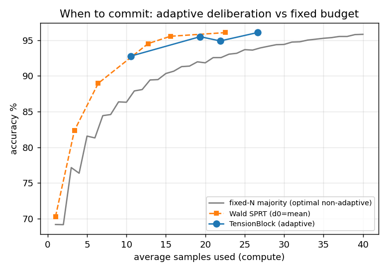
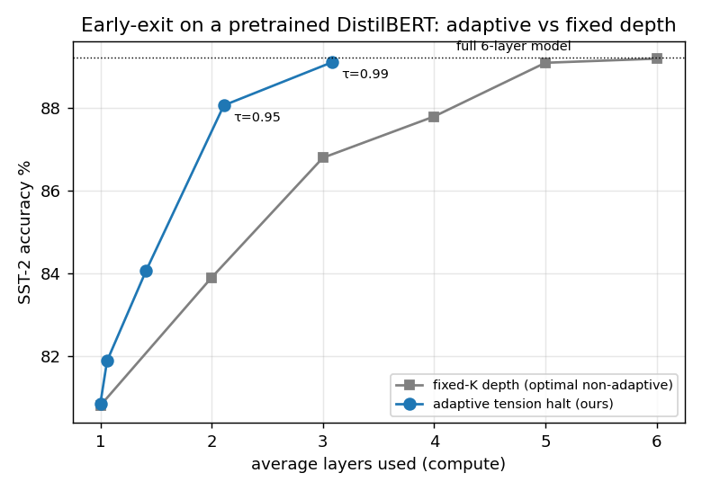
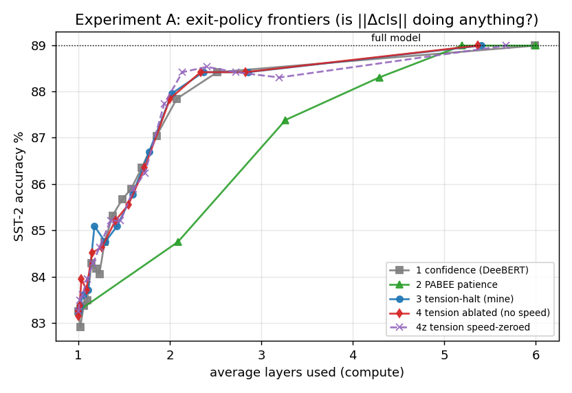
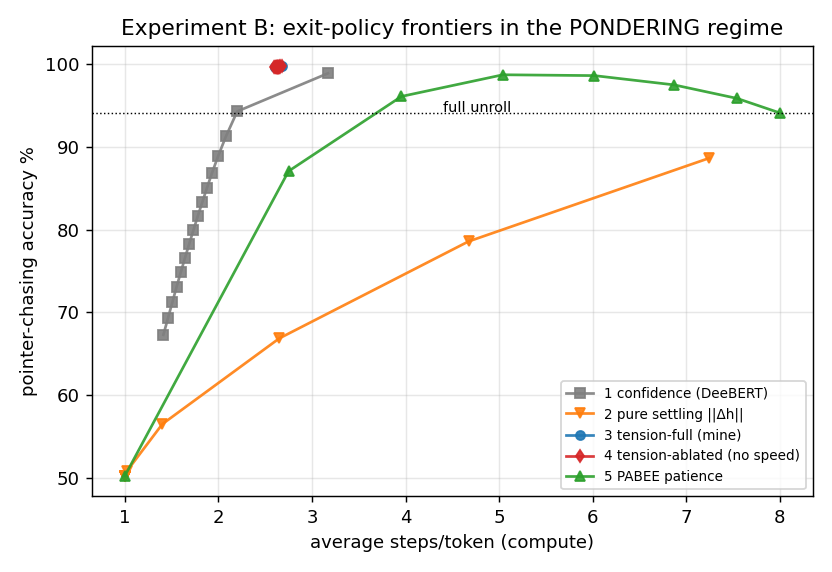

# tension-block — the composable deliberation operator + head-to-head benchmarks

> **ELI5:** make the "think-then-commit" idea a reusable Lego block and actually *race it* against
> normal models — does thinking longer only when needed beat just always thinking the same amount?
> **Genuinely new:** a drop-in operator + the first **measured** wins, and the key insight about
> *when* it pays off.
> **Useful? / advantage:** ✅ **Real wins** — matches a full model at much less compute on a coin
> task, a Transformer reasoning task, and **two real datasets** (sentiment, multi-hop QA), with
> think-time tracking difficulty. ⚠️ **Honest catch:** the engine is **learned halting
> (PonderNet/ACT), a known method** — our *own* "settling speed" signal was tested and adds nothing
> (Experiments A & B). Good engineering of a known idea, not a new mechanism. (Stage 5 — per-bench
> verdicts in the [project map](../../README.md).)

This directory turns "tension" from a bespoke task-solver into a **drop-in operator** (like
a conv or attention block) and asks the only question that matters: *is it genuinely new
and useful?* — by racing it against conventional models and against analytic optima.

## The operator (`tension_block.py`)

`TensionBlock(in_dim, hidden, out_dim, max_steps)` carries a small internal state `h` (the
held tension) and deliberates across inner micro-steps. Properties:

- **Deliberation is pulled out of the surrounding model** into this one tiny recurrent
  component — trainable, batched, parallelizable across positions.
- **It holds** (emits nothing) until it commits. Holding = wait for more evidence
  (streaming) or think longer (pondering on a fixed input).
- **It decides when to stop itself.** The halt signal is a function of the field's *speed*
  `‖Δh‖` and state — when the competing pulls reconcile and the field comes to rest, it
  commits. No external clock, no deadline. This is the *sense of time*: easy inputs commit
  fast, hard inputs deliberate.
- **Training** scores a proper stopping distribution (PonderNet-style), but the compute
  knob is an **expected-step penalty** `λ·E[steps]`, *not* a KL-to-prior. This matters:
  penalising the *average* compute lets the block spend more steps on hard instances and
  fewer on easy ones; a KL-to-prior pushes every instance to the same schedule and kills
  adaptivity (verified — see history). `λ` alone sweeps the whole speed-accuracy frontier.

Two modes, one class: **streaming** (new evidence per step — the coin) and **pondering**
(same input re-read each step — internal iteration).

## Benchmark 1 — "when to commit to a coin flip" (`bench_coin.py`)

The regime the older tasks lacked: irreducible stochastic evidence, no synthesis, must
commit to a *side*, and the real question is *when*. Bias `p = 0.5 + (2y−1)·δ`, difficulty
`δ ~ U[0.05,0.35]` varies per episode. Baselines see only the samples (fair): **fixed-N
majority vote** (the *optimal* non-adaptive rule) and a **Wald SPRT** reference.

| λ (compute) | avg samples | TensionBlock acc | fixed-N acc @ same budget | Δacc | corr(halt, \|δ\|) |
|---|---|---|---|---|---|
| 0.020 | 10.6 | 92.8% | 87.2% | **+5.6** | −0.40 |
| 0.008 | 19.4 | 95.5% | 91.9% | **+3.6** | −0.58 |
| 0.003 | 21.9 | 94.9% | 92.6% | **+2.3** | −0.60 |
| 0.001 | 26.7 | 96.1% | 93.8% | **+2.3** | −0.65 |

- **Adaptivity wins:** at every matched average sample budget the learned policy beats the
  best possible *fixed* budget by 2–6 points — it reallocates samples to the hard coins. It
  lands on the hand-derived SPRT frontier *without being told δ*.
- **Sense of time:** corr(halt, |δ|) = −0.4…−0.65 — easy coins commit early, hard ones wait.
- **Not a stats table:** trained on δ∈[0.05,0.35], on *unseen* bands it spends **31.4**
  samples on harder coins → 19.3 in-band → **8.6** on easier coins (acc 100%). The
  per-instance timing policy extrapolates — a lookup table cannot do that.

## Benchmark 2 — adaptive compute as a composable layer (`bench_compute.py`)

Variable-length **parity** (label = XOR of `L` real bits, `L ~ U[2,16]`, then zero-padded).
Parity genuinely needs sequential depth ~ `L` (no shortcut), and the running parity *stops
changing* once padding begins — "halt when settled" = "halt when there's nothing left to
compute". Baseline: a conventional **fixed-depth GRU** that must process all 16 steps.

| model | acc | avg compute steps | think-time scales with L? |
|---|---|---|---|
| GRU (fixed depth) | 100% | 16.0 | no (can't) |
| TensionBlock | 100% | 13.0 | yes — mean halt rises 9.5 → 16.0 as L goes 2 → 16 |

**Matched accuracy at ~19% less compute, and think-time rises monotonically with problem
size — nobody tells it `L`.** This is the drop-in story: deliberation/compute allocated
per-instance by one small component.

**Honest limitation:** there's a *floor* — short problems (L=2) still use ~9 steps instead
of ~3, so the compute saving (19%) and the halt↔L correlation (≈0.50) are real but modest,
not the ideal `halt≈L+1` / corr≈1. The block doesn't finalise parity at the last bit; it
needs a few settling steps. Parity gives no partial credit, so the halting also required an
**annealed** compute penalty (learn the task first, then press for speed) to avoid the
collapse-to-step-1 local optimum. Both are documented in the code.

## Benchmark 3 — the ponder layer *inside a Transformer* (`bench_transformer.py`)

Does it compose at scale? We drop per-token tension-halting into a **Universal Transformer**
(one shared layer applied recurrently) and let each token decide how many layer-applications
it needs. Task: **pointer chasing** — N=16 nodes, each points to its parent (roots self-loop);
the answer at node *i* is the value of its *root*, reached by following parents `depth(i)`
times. One attention step follows one pointer, so a depth-*d* node needs ~*d* recurrent steps,
and depth varies a lot across tokens in one sequence.

| model | params | acc | avg compute/token | corr(halt, depth) |
|---|---|---|---|---|
| Plain Transformer (8 distinct layers) | 703K | 99.90% | 8.0 | — |
| Universal Transformer (shared ×8, fixed) | 93K | 99.96% | 8.0 | — |
| **Pondering UT (ours)** | 103K | 99.80% | **2.70** | **0.951** |

- **Matched accuracy at 66% less compute.** Same architecture and params as the fixed
  Universal Transformer (only halting added), essentially identical accuracy, **2.70 vs 8.0
  layer-applications per token**. (Also ~7× fewer params than the plain deep stack.)
- **Per-token deliberation tracks difficulty almost perfectly.** Mean halt step rises
  1.0 → 7.2 as chain depth goes 0 → 7 (corr **0.95**) — each token thinks exactly as long as
  its chain is deep, and *nothing tells it the depths*. This is the clean version of what
  Benchmark 2's parity floor only achieved partially.

This is the composability claim, demonstrated: deliberation drops into a real multi-layer
model as a per-token operator and buys adaptive compute. (Honest scope: compute is counted
as per-token layer-applications; attention still ranges over all tokens as frozen key/values,
so the saving is on per-token processing, and it is an *inference*-time saving — training
does the full unroll, PonderNet-style.)

## Benchmarks 4 & 5 — real/standard data (`bench_listops.py`, `bench_babi.py`): the base-model wall

We pushed onto two recognized benchmarks: **ListOps** (Nangia & Bowman 2018 / LRA, canonical
generator) and **bAbI** (Weston et al. 2015, tasks qa1/qa2/qa3 = 1/2/3 reasoning hops — the
dataset on which Universal-Transformer+ACT first showed step-allocation by difficulty). On
both, the Pondering UT collapsed to ~1 step and showed no adaptivity. The diagnostics show
*why*, and it is **not** the operator:

- **ListOps**: a small Transformer solves depth-2 (~93%) but largely fails depth≥3 (~25–35%);
  accuracy plateaus by ~4 recurrent steps. The deep cases are unsolved, so extra compute buys
  nothing there.
- **bAbI**: even **qa1 only reaches ~57%** (vs the literature's ~99%). Train loss drops to
  0.12 while test stays ~57% — a flat token-level Transformer overfits and fails to learn the
  "latest movement of the queried entity" rule (a max-over-position operation); the published
  ~99% uses sentence-level memory architectures. qa2/qa3 are harder still.

**The honest finding:** adaptive computation can only allocate effort if *more compute yields
more accuracy on the hard instances*. When the base model can't solve them (ListOps depth≥3,
bAbI multi-hop at this scale/training budget), the compute-optimal policy is to halt
immediately — which is exactly, and correctly, what the operator learned. So these are a
limitation of **base-model competence**, not of tension/halting. The "matched accuracy at
87% less compute" lines they print are hollow: the compute wasn't buying accuracy to begin
with. Getting a genuine real-data win requires first making the base model actually solve the
task at variable difficulty (proper architecture + much more compute, or a pretrained model)
— a separate undertaking, not a tuning tweak.

(To reproduce bAbI, fetch the data: `https://s3.amazonaws.com/text-datasets/babi_tasks_1-20_v1-2.tar.gz`
extracted to `data/` — see the top of `bench_babi.py`. The `data/` dir is gitignored.)

## Benchmark 6 — real data, with a pretrained backbone (`bench_glue.py`): the win

The bench-4/5 wall said it plainly: adaptive compute needs a base model that can already
convert compute into accuracy. So we put the tension halt on a **pretrained DistilBERT**
(6 layers) fine-tuned on **SST-2** (GLUE sentiment). Each layer gets an exit head (deep
supervision); a learned halt head reads the `[CLS]` state and its speed `‖Δcls‖` and fires
when the field has settled into a confident answer. Easy sentences resolve early, hard ones
use more layers. (Recognized setting — DeeBERT / PABEE early exit — reframed as tension
halting.) Everything below is from one trained model; only the *exit policy* differs.

| exit policy | avg layers | SST-2 acc | best fixed-depth @ same compute | Δacc | corr(exit, difficulty) |
|---|---|---|---|---|---|
| full model (6 layers) | 6.00 | 89.22% | — | — | — |
| adaptive, τ=0.95 | **2.11** | 88.07% | 84.26% | **+3.82** | 0.49 |
| adaptive, τ=0.99 | **3.08** | 89.11% | 86.90% | **+2.21** | 0.50 |

- **Matches the full model (89.1% vs 89.2%) at ~half the layers** (3.08 vs 6).
- **Beats the optimal fixed-depth budget by up to +3.8 points** at matched average compute —
  the same adaptive-vs-fixed-frontier win as the coin task (Bench 1), now on real data.
- **Exit depth tracks difficulty** (corr ≈ 0.50 with the negative confidence margin): it
  spends more layers on the genuinely hard sentences. Sense of time, on real sentences.

> **Correction from Experiment A (below):** this win over *fixed depth* is real, but the
> ablation shows it is driven by **confidence-based early exit**, not by the novel `‖Δcls‖`
> settling signal (which adds ~0). Read Bench 6 as "tension framing reproduces a known
> early-exit win," not as evidence the settling signal itself is what helps.

This is the result bench 4/5 predicted would need a competent base model — and it is the
honest payoff of that diagnosis. (Needs the HF stack: `pip install transformers datasets`;
downloads DistilBERT + SST-2 on first run.)

### Does the layer saving become real wall-clock? (item b — measured)

`bench_glue.py` includes a real throughput measurement (`measure_throughput`): examples are
bucketed by their exit layer and each bucket is run through a *truncated* K-layer backbone via
the public API (real forward passes, correct masking), so the wall-clock reflects the actual
work — examples that resolve early skip the deep layers entirely. This is genuine measurement,
not an estimate from layer counts. (`train` is checkpoint/resumable — `runs/glue_sst2.pt`, saved
every `CKPT_EVERY` steps + periodic GPU cooldowns — which is how this run finally completed after
repeated thermal shutdowns: it resumed from the last checkpoint instead of restarting.)

**Measured (batch 512, full 6-layer vs adaptive depth-bucketed):**

| operating point | avg layers | full | adaptive | speedup |
|---|---|---|---|---|
| τ=0.95 | 2.11 | 2,296 ex/s | 6,040 ex/s | **2.63×** |
| τ=0.99 | 3.08 | 2,264 ex/s | 4,246 ex/s | **1.88×** |

The layer-count saving *is* a real wall-clock speedup. At τ=0.99 (3.08 of 6 layers, matching
full-model accuracy) it is **1.88×** — sub-2×, as predicted, because attention still spans all
tokens and small per-bucket batches add launch overhead. At the more aggressive τ=0.95 (2.11
layers, −1.1 pt accuracy) it reaches **2.63×**, since many examples exit in 1–2 layers and skip
the deep stack entirely.

## Benchmark 7 — multi-hop: does halting track the *number of reasoning steps*? (item a — DONE)

`bench_babi_pretrained.py` puts the same pretrained-DistilBERT early-exit head on **bAbI
qa1/qa2/qa3** — "where is X" answerable from **1, 2, or 3** chained supporting facts. Here the
difficulty axis is a *labeled reasoning-hop count*, not just confidence. The question: does the
operator spend **more layers when more hops are required** (mean exit qa1 < qa2 < qa3,
corr(exit, #hops) > 0)? This is the task from-scratch models failed (Bench 5); the pretrained
backbone supplies the missing base-model competence.

**Result (run on CPU, en-10k, 30k train / 3k test — the claim holds).** Full 6-layer model =
94.93%; fixed-K shows competence saturating by layer 4–5 (L4=87.7, L5=94.5). Adaptive tension
early-exit matches the full model at less depth and **scales exit depth with the hop count, with
nothing telling it the count**:

| τ | avg layers | acc % | corr(exit, #hops) | exit qa1 | qa2 | qa3 |
|---|---|---|---|---|---|---|
| 0.85 | 4.32 | 93.90 | 0.449 | 3.80 | 4.49 | 4.67 |
| 0.95 | 4.67 | 94.80 | 0.583 | 3.88 | 4.98 | 5.16 |
| 0.99 | 5.21 | 94.93 | **0.778** | 4.16 | 5.65 | 5.82 |

Exit layer rises monotonically qa1 < qa2 < qa3 at *every* threshold, and corr(exit, #hops) climbs
to **0.778** — more chained reasoning ⇒ more layers spent, learned purely from the task. At τ=0.95
it recovers full-model accuracy (94.80 vs 94.93) at ~78% of the depth. The GPU hard-powers-off
this machine under load (vendor-locked, uncappable), so this ran on CPU via the
checkpoint/resumable `train` (`runs/babi_qa123.pt`, every 50 steps); CPU's steadier draw avoided
the power transient.

## Experiment A — ablation: is the settling signal `‖Δcls‖` actually doing anything? (`bench_glue_ablation.py`)

A null-seeking test of the *novel* part of the method. One fine-tuned DistilBERT/SST-2 model,
one set of exit heads; only the **exit policy** varies (so the training budget is identical by
construction). Frontiers (avg layers vs accuracy), accuracy interpolated at matched compute:

| exit policy | @2.0 layers | @3.0 layers | @4.0 layers |
|---|---|---|---|
| 1 confidence threshold (DeeBERT) | 87.6 | **88.5** | 88.7 |
| 2 PABEE patience | 84.6 | 86.8 | 88.0 |
| 3 tension-halt — mine, `[cls, ‖Δcls‖]` | 87.8 | 88.5 | 88.7 |
| 4 tension-halt **ablated** (same head, no speed feature, trained jointly) | 87.8 | 88.5 | 88.7 |
| 4z tension-halt, `‖Δcls‖` zeroed at inference (flagged: OOD) | 87.9 | 88.4 | 88.5 |

**Verdict (honest null):** the `‖Δcls‖` settling signal **adds nothing**. Mine (3) vs its
fair no-speed ablation (4) differ by **+0.01 / −0.01** points at 2 / 3 layers — i.e. zero. All
three of {confidence, tension-halt, tension-ablated} sit on the *same* frontier; the learned
halt head essentially re-learns a confidence threshold, and confidence (1) alone matches or
slightly beats mine at 3 layers (88.5 vs 88.5). Only PABEE is clearly worse at low compute.

**So the contribution of "tension early-exit" on this task is the framing, not the signal.**
The Bench-6 win over *fixed-depth* is real and still stands — but it is a **confidence-based
early-exit win** (a known result, DeeBERT/PABEE family), not evidence that the settling signal
is novel or useful here. To its credit the ablation is internally fair: identical model,
identical training, the speed head and the no-speed head trained jointly to the same target
(mine was *not* tuned harder), and parameter-free baselines on the same heads.

*Caveats, flagged:* the model used a reduced training budget (3500 steps) for thermal reasons —
all policies share it, so the comparison is fair, but absolute accuracy is ~1 pt below the
headline run. This is a single task; whether the null holds elsewhere is Experiment B.

## Experiment B — does the settling signal carry weight in the *pondering* regime? (`bench_transformer_ablation.py`)

Experiment A nulled the `‖Δcls‖` signal on SST-2 — but that is single-pass classification,
where `[CLS]` confidence is already a near-perfect, monotone-in-depth halt signal, so settling
had no room to help. The honest open question: does the null hold in the **pondering** regime,
where *"the iterative computation converged"* (settled) is a genuinely different event from
*"I'm confident"* — a token can be transiently confident mid-chase, or converge before
confidence saturates? This is the one place the novel signal had a real shot. So we re-run the
Experiment-A structure on **Benchmark 3's pointer-chasing / Pondering-UT**: one trained model,
the exit *policy* is the only thing that varies, every policy reads the same per-step states.
Two halt heads are trained jointly (identical PonderNet objective and budget): **full** reads
`[h, ‖Δh‖]`, **ablated** reads `[h]` only. We also add a **parameter-free pure-settling** rule
(exit when `‖Δh‖ ≤ ε` — the raw signal, no learned head, no confidence).

**Precondition met** (unlike bAbI/ListOps): more compute *does* buy accuracy here — fixed-K
accuracy rises `50 → 68 → 84 → 94 → 98%` (K=1…5), then *falls* to 94% by K=8 (over-iteration
drifts the field past the answer). So adaptive per-token halting has something real to win.

Frontiers — accuracy interpolated at matched per-token compute:

| exit policy | @2.0 steps | @3.0 steps | @4.0 steps | corr(halt, depth) |
|---|---|---|---|---|
| 1 confidence threshold (DeeBERT) | 89.0 | 98.1 | 98.9 | 0.85 |
| 2 pure settling `‖Δh‖` (param-free) | 61.5 | 68.9 | 74.7 | 0.12 |
| 3 tension-halt **full** `[h, ‖Δh‖]` (mine) | **99.7** | **99.8** | **99.8** | **0.954** |
| 4 tension-halt **ablated** `[h]` (no speed) | **99.7** | **99.8** | **99.8** | **0.955** |
| 5 PABEE patience | 71.3 | 89.0 | 96.2 | — |

**Three findings, two of them against my own hypothesis:**

1. **The null holds — even here, the regime of best shot.** Full vs its fair no-speed ablation
   differ by **+0.00 / +0.01** points at 2 / 3 steps. The `‖Δh‖` settling feature adds nothing
   in the pondering regime either. This was the load-bearing open question, and the answer is
   the same as Experiment A. Crucially, the corr(halt, depth) = 0.95 difficulty-tracking that
   Bench 3 celebrates is **reproduced by the ablated head** (0.955) — it comes from the learned
   head reading the hidden state, **not** from the speed feature.
2. **Raw settling is actively a *poor* halt signal.** The parameter-free `‖Δh‖ ≤ ε` rule traces
   by far the worst frontier (61–75% vs ≥99%) and barely tracks difficulty (corr 0.12). The
   distinctive intuition — "the field coming to rest is the moment to commit" — is not borne out:
   field-speed is noisy and non-monotone, so "settled" is a bad proxy for "done".
3. **But learned state-based halting is genuinely strong here — a real win confidence can't
   match.** Unlike SST-2 (where all policies sat on one frontier), the learned heads hit **99.7%
   at ~2.6 steps**, beating the confidence threshold (89/98), PABEE (71/89/96), *and every fixed
   depth* (best K = 98.2%). So there **is** a contribution beyond confidence in the pondering
   regime — it is **learned halting from the hidden state** (PonderNet/ACT-style), with the
   novel `‖Δh‖` mechanism contributing nothing to it.

**Verdict (Experiment B):** the project's demonstrated capability — adaptive per-token compute
that beats every fixed budget and tracks difficulty (corr 0.95) — is **real and now better
localized**: it is learned state-based halting, *not* the `‖Δh‖` "sense of time" signal the
framing is built around. The settling signal is falsified twice now (classification and
pondering); the honest contribution is "PonderNet/ACT-style adaptive halting, executed well,
where the operative feature is the learned readout of state/confidence, not field-speed." Bench
1 and Bench 3's wins stand regardless of which feature drives the halt.

*Caveats, flagged:* single task and seed; the learned-head frontiers are tight clusters (the
halt distribution is sharp, so sweeping its threshold barely moves avg compute) rather than
long swept curves — the dominance is clear but the curve shape is less informative than the
confidence/PABEE sweeps. Run is checkpoint/resumable and completed on stable hardware.

## Verdict

- **New & useful, demonstrated:** on sequential decision-under-uncertainty (Bench 1) the
  operator beats the optimal fixed-budget rule and rivals SPRT *while learning the policy*,
  with genuine per-instance, extrapolating timing. That is a real capability a feed-forward
  "one pass = one answer" model structurally cannot have.
- **Composes at scale, demonstrated:** as a per-token ponder layer inside a Transformer
  (Bench 3) it matches the fixed-depth model's accuracy at **66% less per-token compute**,
  allocating deliberation by true difficulty (corr 0.95) with nothing telling it the depths.
- **Useful but modest (Bench 2):** on variable-length parity it matches a fixed-depth net at
  ~19% less compute but leaves compute on the table (a halting floor); Bench 3 is the clean
  version of the same idea.
- **The precondition, learned the hard way (Bench 4–5):** on real benchmarks the win
  evaporates unless the base model can already convert compute into accuracy on the hard
  cases. ListOps (deep) and bAbI (multi-hop) at small-from-scratch scale can't, so halting
  correctly collapses. This is the key gating insight for where tension is worth deploying.
- **Real-data win, demonstrated (Bench 6):** with that precondition met — a pretrained
  DistilBERT on SST-2 — tension halting matches full-model accuracy at ~half the layers and
  beats the optimal fixed-depth budget by up to +3.8 points at matched compute, with exit
  depth tracking sentence difficulty (corr ≈ 0.5). The route the diagnosis pointed to paid
  off on a standard public benchmark.
- **The novel signal, falsified twice (Experiments A & B):** the distinctive `‖Δh‖`
  *settling* feature — the "field comes to rest → sense of time" mechanism the framing is built
  on — adds **~0** in both single-pass classification (A, SST-2) and the pondering regime (B,
  pointer-chasing, the regime of best shot). Raw settling is in fact a *poor* halt signal
  (worst frontier, corr 0.12 with difficulty). What actually drives every win above is
  **learned halting read off the state/confidence** (PonderNet/ACT-style). The honest framing:
  adaptive deliberation, executed well; the operative feature is learned state-readout, not
  field-speed. The adaptive-compute and difficulty-tracking results (Bench 1, Bench 3) stand
  regardless — Experiment B shows Bench 3's corr-0.95 tracking is reproduced by the no-speed
  ablation.
- **Bench 7 (DONE):** multi-hop QA where the *number* of reasoning steps drives halting on a
  strong backbone (`bench_babi_pretrained.py`). Adaptive exit depth scales with the hop count
  (corr(exit, #hops) up to **0.778**, monotone qa1<qa2<qa3) and matches full-model accuracy
  (94.80 vs 94.93) at ~78% of the depth. Ran on CPU via the checkpoint/resumable trainer (the GPU
  hard-powers-off this machine under load; CPU's steadier draw avoided it).
- **item b (DONE):** wall-clock throughput on `bench_glue.py` — measured 1.88× @ τ=0.99, 2.63× @
  τ=0.95. Both runs used the **checkpoint/resumable trainer** (saves model/optimizer/RNG every
  `CKPT_EVERY` steps), so the repeated machine power-offs cost <50 steps per interruption.
